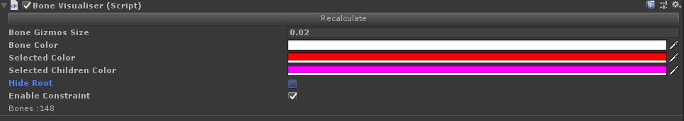
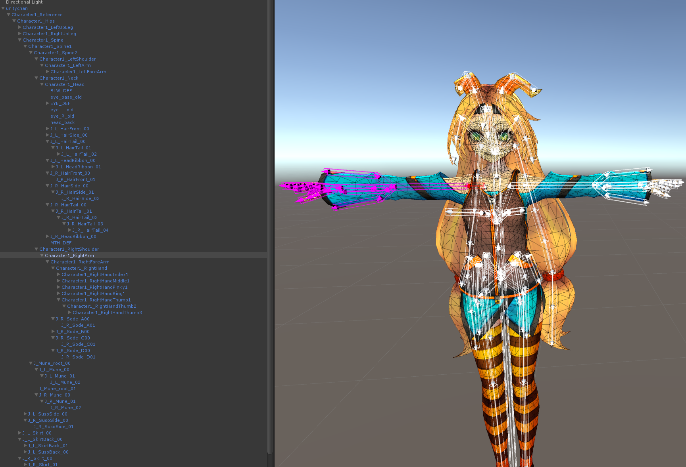
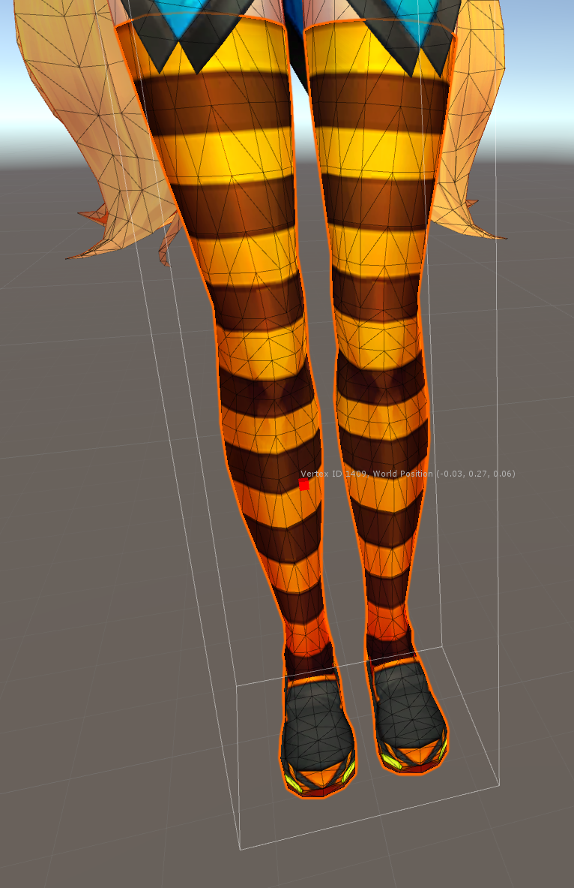
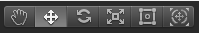

# UnityBoneTools

## Show the vertices(triangles) influenced by the selected bone.
Usage: Tools/BoneMode

## Show bones in Scene View
Usage: Add the component "BoneVisualiser" to the GameObject which has SkinnedMeshRenderer(s) itself or in its children.

You should click the button "Recalculate". You will see bones as below.

You can either click a GameObject in the Hierarchy or a cone in the Scene. Then you will see the selected bone and its children colored.

NOTE: This feature refers from  [BoneTool-Bone Visualizer](https://assetstore.unity.com/packages/tools/utilities/bonetool-bone-visualizer-99464) .

## Select some vertex and show its information
Usage: Tools/VertexSelector

NOTE: Only available when Tools.current == Tool.Move

